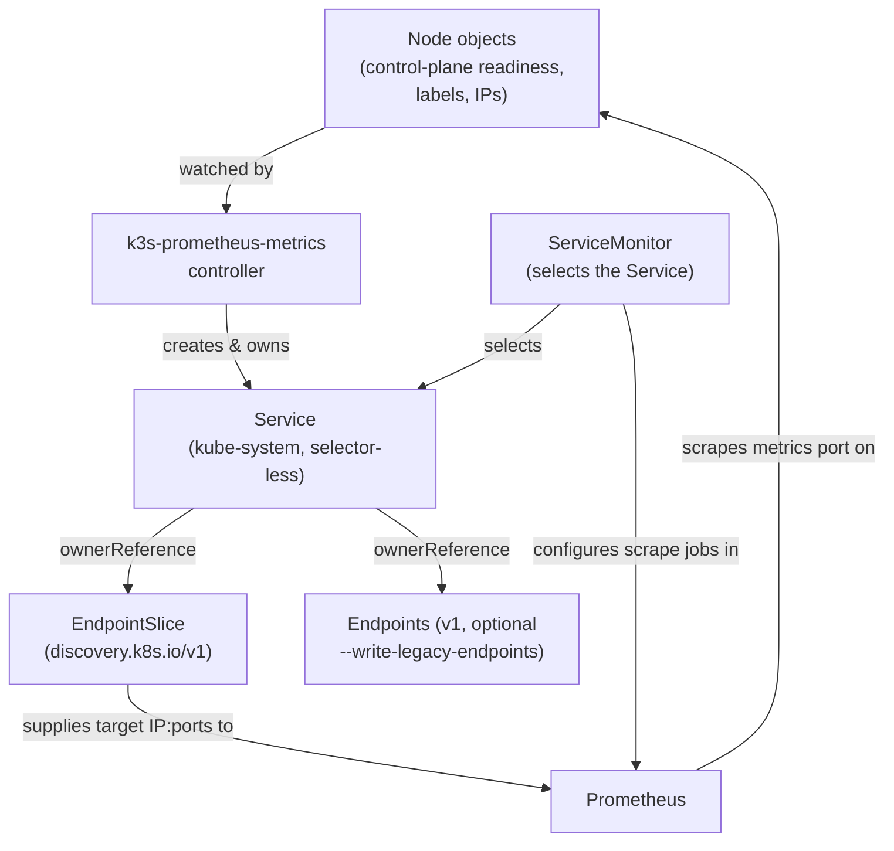

### k3s-prometheus-metrics - expose k3s control-plane metrics to Prometheus

This is a Kubernetes controller that watches Node objects on a
[k3s](https://k3s.io/) cluster and creates/updates
[`discovery.k8s.io/v1` EndpointSlice](https://kubernetes.io/docs/concepts/services-networking/endpoint-slices/)
objects (a list of IP:port targets behind a Service, and the modern
replacement for the older `v1` Endpoints API; optionally this controller
also writes legacy `v1` Endpoints, for Kubernetes older than 1.33) pointing
at the kube-scheduler and kube-controller-manager metrics ports on each
control-plane node, and the kube-proxy metrics port on every node. That
lets an in-cluster Prometheus (via
[kube-prometheus] jsonnet or the [kube-prometheus-stack] Helm chart) scrape
control-plane metrics the same way it would on a normal upstream Kubernetes
cluster.

[kube-prometheus]: https://github.com/prometheus-operator/kube-prometheus
[kube-prometheus-stack]: https://github.com/prometheus-community/helm-charts/tree/main/charts/kube-prometheus-stack

Here's how the pieces fit together (details on each step are in
[Architecture](#architecture) below):



## Background

Unlike upstream Kubernetes, k3s does not ship Services/EndpointSlices for
its bundled control-plane components' metrics endpoints, and the k3s
maintainers have declined to add this to k3s's own EndpointSlices
controller by default. See
[k3s-io/k3s#3619](https://github.com/k3s-io/k3s/issues/3619). k3s also
binds these control-plane metrics ports to loopback by default, so a
cluster admin must pass extra flags to `k3s server`/`k3s agent` to bind
them to `0.0.0.0` before anything running elsewhere in the cluster (such as
Prometheus) can reach them.

This project exists for admins who have already opted into exposing those
metrics ports and want them discovered and scraped the same way upstream
Kubernetes control-plane metrics normally are, without waiting on upstream
k3s support.

### Enabling the metrics ports on k3s

k3s has no dedicated "expose metrics" flag. Bind addresses are set via its
generic passthrough flags to the underlying components. `--kube-scheduler-arg`
and `--kube-controller-manager-arg` only need to go on `k3s server`, since
those components only run on server (control-plane) nodes. `--kube-proxy-arg`
is different: it's a per-node-process flag that does **not** propagate from
the server, so it must be set on **every** node's own `k3s server` or `k3s
agent` invocation/config, not just the servers'.

On each server node:

```bash
k3s server \
  --kube-scheduler-arg=bind-address=0.0.0.0 \
  --kube-controller-manager-arg=bind-address=0.0.0.0 \
  --kube-proxy-arg=metrics-bind-address=0.0.0.0:10249
```

On each agent node:

```bash
k3s agent \
  --kube-proxy-arg=metrics-bind-address=0.0.0.0:10249
```

(Add `--kube-proxy-arg=healthz-bind-address=0.0.0.0:10256` too if you also
want kube-proxy's healthz endpoint reachable. This controller does not
manage that port.)

| Component | Port | Scheme |
|-----------|------|--------|
| kube-scheduler | 10259 | https |
| kube-controller-manager | 10257 | https |
| kube-proxy | 10249 | http |

These ports are stable and version-independent. The older insecure ports
(10251/10252) were removed upstream in Kubernetes 1.22/1.23, so this
controller does not fall back to them.

### Features

- Watches Node objects and tracks control-plane readiness automatically.
  No static target lists to maintain as nodes join, leave, or change role.
- Manages `discovery.k8s.io/v1` EndpointSlice objects for kube-scheduler,
  kube-proxy, and kube-controller-manager metrics ports
- Optional legacy `v1` Endpoints output for clusters running Kubernetes
  older than 1.33
- Designed to be scraped like a normal upstream Kubernetes control plane.
  No custom relabeling required in kube-prometheus/kube-prometheus-stack.

## Installation

### Using a Container Image

Pull the container image from GitHub Container Registry:

```bash
docker pull ghcr.io/zakame/k3s-prometheus-metrics:master
```

(Tagged releases publish an `X.Y.Z` image tag (no `v` prefix) in addition to
`master`; see the [releases page](https://github.com/zakame/k3s-prometheus-metrics/releases).)

### Building from Source

Requirements:

- Go 1.27 or later

```bash
git clone https://github.com/zakame/k3s-prometheus-metrics.git
cd k3s-prometheus-metrics
make build
./bin/k3s-prometheus-metrics
```

Running it locally like this uses your current kubeconfig context. That is
useful for testing against a real cluster before deploying in-cluster.

## Usage

The controller needs a `ServiceAccount` with permission to list/watch
Nodes and create/update Services and EndpointSlices (and, if
`--write-legacy-endpoints` is set, Endpoints). See [Kubernetes
Deployment](#kubernetes-deployment) below for the RBAC this requires. Once
running, it reconciles continuously. No scheduling flag is needed to make
it re-check node state periodically, since it watches Node objects
directly.

### CLI Flags

| Flag | Default | Description |
|------|---------|--------------|
| `--namespace` | `kube-system` | Namespace to create/update Service, EndpointSlice (and, if enabled, Endpoints) objects in. Independent of the namespace the controller itself is deployed in. |
| `--node-selector` | `node-role.kubernetes.io/control-plane=true` | Comma-separated `key=value` node label selector identifying control-plane nodes, for kube-scheduler and kube-controller-manager. k3s sets this label to `true`; a kubeadm cluster would use an empty value instead. **Not used for kube-proxy**, which always matches every node regardless of this flag. |
| `--write-legacy-endpoints` | `false` | Also create/update legacy `v1` Endpoints objects, for Kubernetes clusters older than 1.33. |
| `--metrics-bind-address` | `:8080` | Address the controller's own Prometheus metrics endpoint binds to. |
| `--health-probe-bind-address` | `:8081` | Address the controller's `/healthz` and `/readyz` probe endpoint binds to. |
| `--leader-elect` | `false` | Enable leader election: if you run more than one replica of the controller, they coordinate via a Kubernetes Lease object to agree on a single active replica, so only one of them reconciles at a time. |

The monitored cluster must be running Kubernetes 1.21 or later, since that
is when `discovery.k8s.io/v1` EndpointSlice (which this controller always
writes, regardless of `--write-legacy-endpoints`) graduated to GA.

The controller also accepts the standard controller-runtime zap logging
flags (`-zap-devel`, `-zap-encoder`, `-zap-log-level`, `-zap-stacktrace-level`,
`-zap-time-encoding`).

### One-shot manifest generation: `manifests` subcommand

For clusters that rarely change (a single-node homelab, or an on-prem
cluster without node autoscaling), running the controller continuously is
more than you need. `k3s-prometheus-metrics manifests` lists Nodes once and
prints the same Service/EndpointSlice (and, with `--write-legacy-endpoints`,
Endpoints) objects the live controller would converge to, as YAML on
stdout:

```bash
k3s-prometheus-metrics manifests --node-selector=node-role.kubernetes.io/control-plane=true > manifests.yaml
kubectl apply -f manifests.yaml
```

It accepts `--namespace`, `--node-selector`, and `--write-legacy-endpoints`
-- same meaning as the controller flags above. It only needs read access to
Nodes (`get`, `list`); it never touches Services, EndpointSlices, or
Endpoints itself.

Since it doesn't set `ownerReferences` (there's no live Service to own them
against yet), re-running and re-applying won't clean up a service whose
node set has dropped to zero. Prune by label instead. Service and (legacy)
Endpoints carry `app.kubernetes.io/managed-by`; EndpointSlice carries a
different label, `endpointslice.kubernetes.io/managed-by`, so pruning both
kinds takes two commands:

```bash
kubectl apply -f manifests.yaml --prune -l app.kubernetes.io/managed-by=k3s-prometheus-metrics \
  --prune-allowlist=core/v1/Service
kubectl apply -f manifests.yaml --prune -l endpointslice.kubernetes.io/managed-by=k3s-prometheus-metrics \
  --prune-allowlist=discovery.k8s.io/v1/EndpointSlice
```

Add `--prune-allowlist=core/v1/Endpoints` to the first command if you
generated with `--write-legacy-endpoints`. `kubectl`'s `--prune` is still
alpha as of 1.36; read its `--help` warning before relying on it.

## Kubernetes Deployment

Sample manifests are available in [`deploy/standard/`](deploy/standard/):

- `namespace.yaml`: a `monitoring` namespace for the controller Deployment
  (idempotent if you already have one, e.g. from kube-prometheus-stack)
- `serviceaccount.yaml`, `role*.yaml`, `rolebinding*.yaml`: the
  `ServiceAccount` and least-privilege RBAC the controller needs (see below)
- `deployment.yaml`: the controller Deployment itself, scheduled onto
  control-plane nodes with `--leader-elect` enabled
- `servicemonitor.yaml`: `ServiceMonitor` objects wiring the
  controller-managed Services into a Prometheus Operator setup (see below)
- `kustomization.yaml`: ties the above together

```bash
kubectl apply -k deploy/standard/
```

The `kube-scheduler`, `kube-controller-manager`, and `kube-proxy` Service
objects themselves aren't part of these manifests: the controller creates
and owns them on first reconcile (see [Architecture](#architecture) below).

### Local/dev testing: `deploy/dev/`

[`deploy/dev/`](deploy/dev/) is a Kustomize overlay on top of
`deploy/standard/` for iterating against your own image on a private
registry, and for testing on a cluster that doesn't have the Prometheus
Operator's `ServiceMonitor` CRD installed at all: it patches out
`servicemonitor.yaml`'s three `ServiceMonitor` objects and `namespace.yaml`
(so it also won't fight a `monitoring` Namespace already managed by a live
kube-prometheus-stack install). Point it at your own image, then apply:

```bash
make dev-image IMAGE=registry.example.com/k3s-prometheus-metrics TAG=dev
kubectl apply -k deploy/dev-local/
```

`make dev-image` builds and pushes a linux/amd64+linux/arm64 image via
[`ko`](https://ko.build/) (the same tool the release path uses), then
generates `deploy/dev-local/kustomization.yaml` -- an overlay on top of
`deploy/dev/` pointing at your image. That file is gitignored and
regenerated on every run, so `deploy/dev/kustomization.yaml` itself never
needs editing or reverting. It needs registry auth already configured
(`ko` reads the local Docker credential store, same as `docker login`).

For a quick local smoke test without pushing anywhere, `make docker-build`
builds a single-arch image locally (`$(BINARY):dev`) via `ko build --local`,
loaded straight into the local Docker daemon.

### Port names and existing kube-prometheus ServiceMonitors

The `kube-scheduler` and `kube-controller-manager` Services/EndpointSlices
use the port name `https-metrics` and the `kube-proxy` one uses
`http-metrics` (set in `internal/config.DefaultServices`). The
`https-metrics` name is not arbitrary. It matches
[kube-prometheus]'s own stock
`kubernetesControlPlane-serviceMonitorKube{Scheduler,ControllerManager}.yaml`
ServiceMonitors exactly (same port name, bearer-token auth, skip-verify TLS,
and separate `/metrics/slis` scrape). **If your cluster already runs
kube-prometheus's bundled control-plane ServiceMonitors, you likely don't
need `servicemonitor.yaml`'s kube-scheduler/kube-controller-manager entries
at all.** The Service and EndpointSlice this controller creates are enough
on their own for kube-prometheus's existing ServiceMonitors to start
matching. `servicemonitor.yaml` provides equivalent ServiceMonitors for
kube-prometheus-stack users, or anyone not already running kube-prometheus's
stock ones.

kube-proxy has **no upstream kube-prometheus ServiceMonitor at all**. Its
metrics port is unauthenticated plain HTTP rather than HTTPS with delegated
authz, so it doesn't fit the scheduler/controller-manager pattern, and
kube-prometheus drops it for the same host-network/loopback-bind story this
project exists to work around. The `http-metrics` port name and its
ServiceMonitor entry are this project's own convention.

### Prerequisite: Prometheus RBAC for secured metrics endpoints

Scraping the kube-scheduler and kube-controller-manager `https-metrics`
endpoints requires the scraping Prometheus's own `ServiceAccount` to be
authorized for `nonResourceURLs: ["/metrics", "/metrics/slis"]` (verb
`get`) against the Kubernetes API server's delegated authorization. This
project's manifests do not (and cannot) grant that, since it's RBAC on the
*scraper's* identity, not the controller's. Both kube-prometheus's
`prometheus-k8s` `ClusterRole` and kube-prometheus-stack's default
Prometheus `ClusterRole` already include this grant, so this is normally
already satisfied. Just be aware of it if you've stripped down Prometheus's
default RBAC.

### RBAC

Kubernetes RBAC (role-based access control) grants a `ServiceAccount`
permissions by binding it to a `Role` (namespace-scoped) or `ClusterRole`
(cluster-wide) via a `RoleBinding`/`ClusterRoleBinding`. This project's RBAC
is split across three role/binding pairs, each scoped to the least access
it needs rather than one broad grant:

- `role.yaml` + `rolebinding.yaml`: a `ClusterRole`/`ClusterRoleBinding`
  granting only `get`, `list`, `watch` on `nodes`. Cluster-scoped because
  Node objects have no namespace. Read-only because the controller never
  modifies Nodes themselves. `role.yaml` is generated from
  `+kubebuilder:rbac` markers via `make manifests`.
- `role-endpoints.yaml` + `rolebinding-endpoints.yaml`: a namespaced
  `Role`/`RoleBinding` **in `kube-system`** (matching the `--namespace`
  default) granting `get`, `list`, `watch`, `create`, `update` on
  `discovery.k8s.io` `endpointslices` and core `endpoints`/`services` (the
  latter for the selector-less Services the controller now creates and
  owns itself). No `patch` verb: the controller only ever does
  read-then-create-or-update, never a partial patch. If you change
  `--namespace`, this Role and RoleBinding must move to that namespace too.
  Hand-maintained rather than generated, since
  controller-gen only produces one ClusterRole from all markers and can't
  express "cluster-wide read, namespace-scoped write" as separate
  namespaced roles.
- `role-leader-election.yaml` + `rolebinding-leader-election.yaml`: a
  namespaced `Role`/`RoleBinding` **in `monitoring`** (the controller's own
  namespace) granting access to `coordination.k8s.io` `leases`, needed
  because `--leader-elect` coordinates via a Lease in the pod's own
  namespace, plus `create`/`patch` on core `events`, since leadership
  changes record Events against that Lease.

The net effect: a compromised controller pod can read Nodes cluster-wide,
but can only create/modify Services, EndpointSlices, Endpoints, or Leases
in the two specific namespaces it actually needs. Not cluster-wide, and
not in any other namespace.

### Verifying Prometheus is scraping the new targets

Once the controller is running and has reconciled at least once (it creates
the Services itself; there's no separate manifest to apply for them):

```bash
kubectl get endpointslices -n kube-system -l endpointslice.kubernetes.io/managed-by=k3s-prometheus-metrics
```

should list one EndpointSlice per service (`kube-scheduler-metrics`,
`kube-controller-manager-metrics`, `kube-proxy-metrics`), each with one
endpoint address per matching node (control-plane nodes only for
kube-scheduler/kube-controller-manager; every node for kube-proxy). From
there, check
Prometheus's own **Status → Targets** page for the `kube-scheduler`,
`kube-controller-manager`, and `kube-proxy` jobs to confirm scrapes are
succeeding. A `context deadline exceeded` or `403`-style scrape error there
most likely means the metrics port isn't actually bound to a non-loopback
address yet (see [Enabling the metrics ports on
k3s](#enabling-the-metrics-ports-on-k3s)), or the Prometheus RBAC
prerequisite above isn't satisfied.

## Architecture

The controller is built on [controller-runtime](https://github.com/kubernetes-sigs/controller-runtime).
See [docs/ARCHITECTURE.md](docs/ARCHITECTURE.md) for the package layout and
test suite organization. The rest of this section covers what operators
need to know about the objects the controller manages.

### Where the Service/EndpointSlice/Endpoints objects live

The controller Deployment itself runs wherever you place it (e.g. a
`monitoring` namespace), but the Service, EndpointSlice, and Endpoints
objects it manages are created in **`kube-system`**, not the controller's
own namespace. That matches upstream kubeadm clusters, where kube-prometheus
and kube-prometheus-stack's bundled ServiceMonitors already expect to find
`kube-scheduler`, `kube-proxy`, and `kube-controller-manager` Services in
`kube-system`.

The Service matters even though nothing ever sends traffic through it: a
Prometheus Operator `ServiceMonitor` (a custom resource that tells
Prometheus which Services to scrape, and how) selects a Service by its
labels, not an EndpointSlice directly. Without a Service to select on, a
`ServiceMonitor` has nothing to attach to, no matter how correct the
EndpointSlice's target list is. So this controller creates a normal-looking
Service for each of kube-scheduler, kube-controller-manager, and kube-proxy,
except with no `spec.selector`, since nothing is pod-backed here, unlike
a typical Service that fronts a Deployment's Pods. It then owns the
EndpointSlice (and, if enabled, the legacy Endpoints object) that supplies
that Service's actual targets, via a controller `ownerReference`:
Kubernetes's built-in parent/child link for garbage collection, so
deleting the Service is enough to delete the EndpointSlice/Endpoints too,
with nothing left behind. The controller creates and owns all of this
itself, so existing kube-prometheus/kube-prometheus-stack ServiceMonitors
pick up the targets with no relabeling changes and no separate manifest to
apply for the Services. See the diagram near the top of this README for
how these objects, the controller, and Prometheus's `ServiceMonitor` all
connect.

## License

See [LICENSE](LICENSE) file for details.
